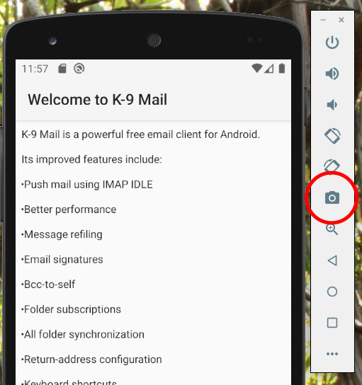

# K-9 Documentation Repo

Documentation for [K-9 Mail](https://k9mail.app/).

Uses [mkdocs](https://www.mkdocs.org/) to generate static HTML.

Changes to the `main` branch are automatically published to the
website using Github Actions.

You can preview local changes using `pip install mkdocs-material`; `mkdocs serve`,
then visiting http://127.0.0.1:8000/

## Creating Screenshots

For consistency of appearance, we use a virtual device with the following settings for taking screenshots.

* Name: Nexus 5 
* Size: 1080x1920 
* Density: xxhdpi
* API 29 "Android 10.0 (Google APIs)" - not "... (Google Play)"

Once created, swipe away the "Set up SD card" notification to reduce clutter.

Follow the [System UI Demo Mode](https://android.googlesource.com/platform/frameworks/base/+/master/packages/SystemUI/docs/demo_mode.md)
activation instructions:

```
adb shell settings put global sysui_demo_allowed 1     # only needed once
adb shell am broadcast -a com.android.systemui.demo -e command enter
```

The Android emulator has a built-in screenshot function, so you do not need crop your desktop.

To take a screenshot use the camera icon on the right of the emulator screen.



The screenshot will be saved in a default location, which can be found in the settings (click
the botton "..." icon, then "Settings" -> "Screenshot Save Location")
