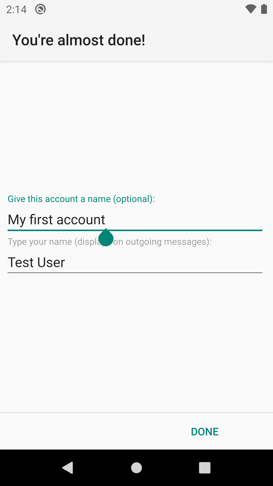

# Add an Account
The account set-up wizard will launch automatically after the [Welcome Screen](../setup/welcome.md). 

For any additional accounts they can be added by going to the accounts menu, 
and then tapping the 'Add account' option in the overflow menu.

First you are asked for your email address and password.

The buttons "Manual setup" and "Next" become only activated after a correctly formatted email address and a password
have been typed in.

 

If you choose "Next" and the domain part of your email address is known to K-9 Mail, the connection settings for the 
incoming and outgoing server are automatically set up for you. This is the case for some large email providers, 
e.g. Gmail, Yahoo!, and AOL.

We also [list information on the settings for major e-mail providers](provider_settings.md).

## Account Type

If you need to configure it manually, you will need to first choose an account type.
The available options are POP3 and IMAP.

All of these are names of protocols to access your mailbox. If your email provider supports it, we strongly recommend 
you use IMAP. It is superior to the others and well supported by K-9 Mail.

For more information see the linked Wikipedia entries:

* [IMAP](https://en.wikipedia.org/wiki/Internet_Message_Access_Protocol)
* [POP3](https://en.wikipedia.org/wiki/Post_Office_Protocol)

## Incoming Server Settings

To configure your incoming server settings see the corresponding page

* [IMAP](incoming_imap.md)
* [POP3](incoming_pop3.md)

## Configuring the outgoing server

To be able to send mail K-9 Mail needs to know the settings to your provider's 
[SMTP](https://en.wikipedia.org/wiki/SMTP) server. In this step of the account creation process you have to provide 
those details. Below is an explanation of the different settings. In certain circumstances, you may need to use a 
different outgoing server than you'd expect; we'll discuss those later.

Because of the nature of email service, you often (if not always, these days) send outgoing mail to one server, but 
pick up incoming mail from a separate one; this is why many of the items below say "this is often, but not always, the
 same as the setting for incoming mail".

**SMTP server**: This is the hostname or IP address of your SMTP server. As discussed above under **IMAP Server**, this
name or IP must be accessible from any network from which you may want to send mail, whether your cellular carrier's
WAN or a private LAN via Wi-Fi. See below for more details if you have trouble.

**Security type**: This specifies the cryptographic protocol that should be used when connecting to your SMTP server. 
Available options are:

* None: This doesn't use any transport security at all.
* SSL/TLS (if available): TLS is used but the server's certificate isn't checked for validity.
* **SSL/TLS (always)**: TLS is used and the server's certificate is checked.
* STARTTLS (if available): The STARTTLS method is used if available, but the server's certificate isn't checked. If STARTTLS is not
available, no encryption is used at all.
* **STARTTLS (always)**: The STARTTLS method is used and the server's certificate is checked.

**Port**: The port number your provider's SMTP is listening on. This may be *465* or *587*, and in rare cases *25*, 
depending on the configuration and transport security settings of your server and K-9.

**Require sign-in**: Tells K-9 Mail whether or not it will be expected to authenticate to the server. In almost all 
cases this needs to remain checked.

**Username**: The username that's needed to authenticate to the SMTP server. This is usually equal to either the
left-hand side of, or the entire, email address; your mail server operator should have told you what to use as an
Outgoing username -- and it will commonly be identical to the incoming username, though not always.

**Authentication**: This specifies which authentication method to use. Available options are:

* **Normal Password**: This is the default method that will automatically detect which authentication methods are supported.
You shouldn't need to change this.
* **Encrypted Password**: Use this if your server doesn't support transport security but supports the CRAM_MD5 authentication
method.
* **Client Certificate**: The server expects (only) a client certificate during the TLS connection. The server must not require a password.

**Password**: The password that's needed to authenticate to the SMTP server. This is often, though not always, identical
to the password for the incoming server.

**Client Certificate**: If the server expects a TLS client certificate to be provided during the initial connection,
use this to select one from the local Android certificate store.

To complete the outgoing server configuration click "Next". Again, K-9 Mail tries to connect to the server to verify
the settings you just entered.

## Account options

After successfully setting up the incoming and outgoing servers, you can now configure some basic settings on how often
K-9 Mail checks for new messages, if you want to be notified of new mail, etc. These settings are specific to each 
account/mailbox you configure; you can set them differently for different mailboxes.

**Folder poll frequency**: Here you specify in what interval K-9 Mail should check the incoming server to see if there 
are new messages. Available options are:

* Never
* Every 15 minutes
* Every 30 minutes
* Every hour
* Every 2 hours
* Every 3 hours
* Every 6 hours
* Every 12 hours
* Every 24 hours

**Number of messages to display**: This value determines how many messages are kept locally cached and displayed. 
Available options are:

* 25 messages
* 50 messages
* 100 messages
* 250 messages
* 500 messages
* 1000 messages

Higher values have some performance implications. See [*Local folder size*](../settings/account.md#local-folder-size) 
for more information.

**Notify me when mail arrives**: If this is checked you are notified when a new message was downloaded in this mailbox.
Notification type (LED, vibration) and ringtone can be configured later. See 
[*Notifications*](../settings/account.md#notifications) for more information.

## Last step

To complete the account creation you have to fill out the following two fields:

**Give this account a name** (optional): This is the name of the account that will be displayed in the account list. If
you leave this field empty the email address associated with this account will be used.

**Type your name**: This will be used as your name for messages sent using this account. Recipients
of your email will see this name.

Once you've done this, click "Done", and the account will be completely set up.
