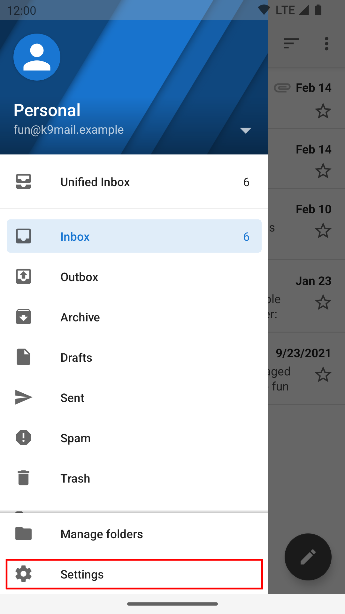
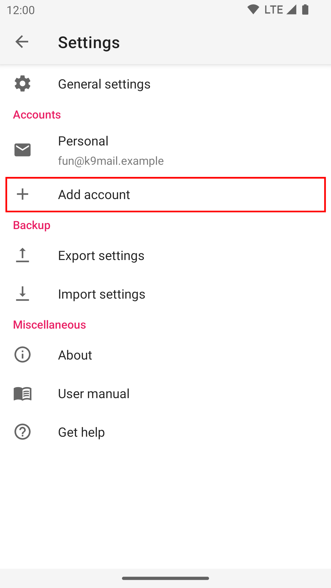

# Adding another account

Once you have a first account set up, you can add another using the settings icon at the bottom
of the screen.

Select add account:

The rest of the procedure is the same as for the [initial account setup](add.md).

