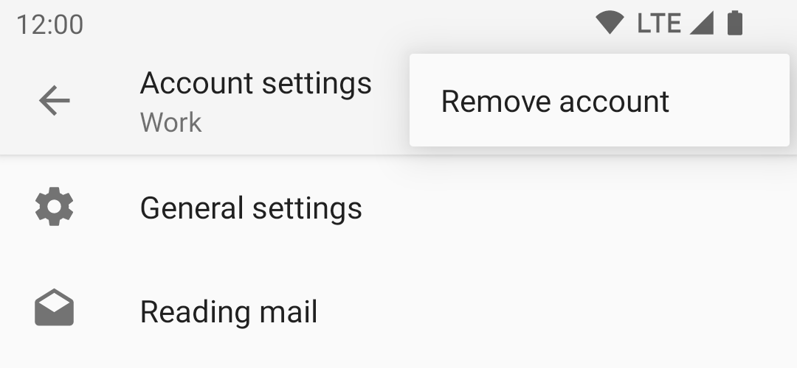

# Removing an Account

To remove an email account from K-9 Mail do the following.

1. Go the settings screen by opening the side drawer and selecting "Settings".

    

1. Select the account that you want to delete.
   
    

1. Select the menu icon in the top corner.
   
    

1. Select the option "Remove account" from the menu.
   
    

1. Press "OK" to confirm the removal. This cannot be undone.

If you remove the only account, you will return to the initial welcome screen and be prompted
to set up a new account.
