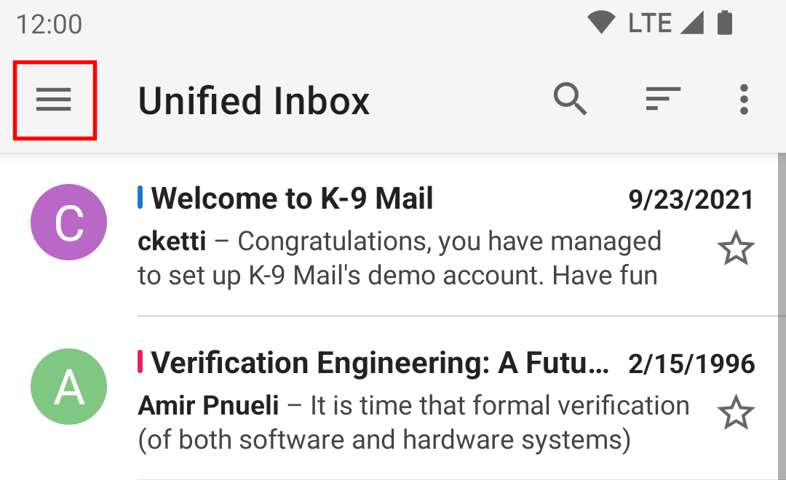
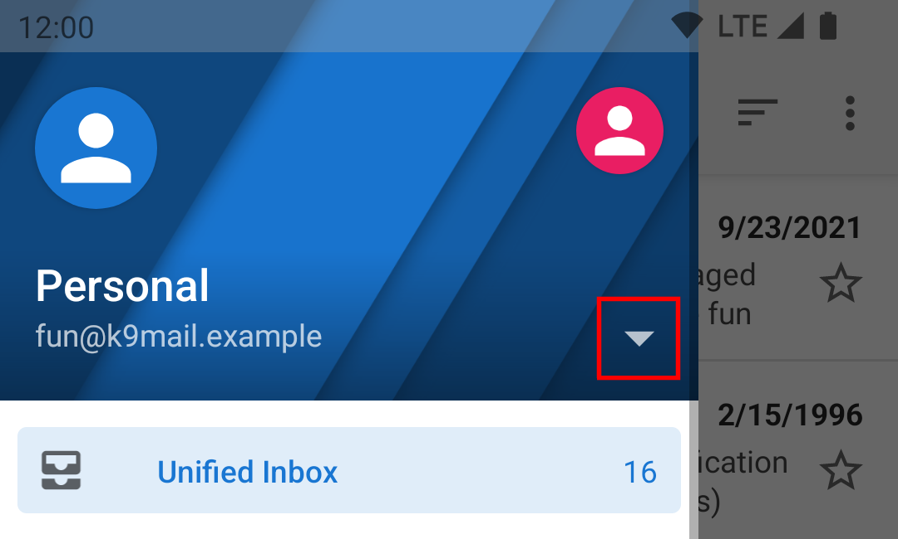
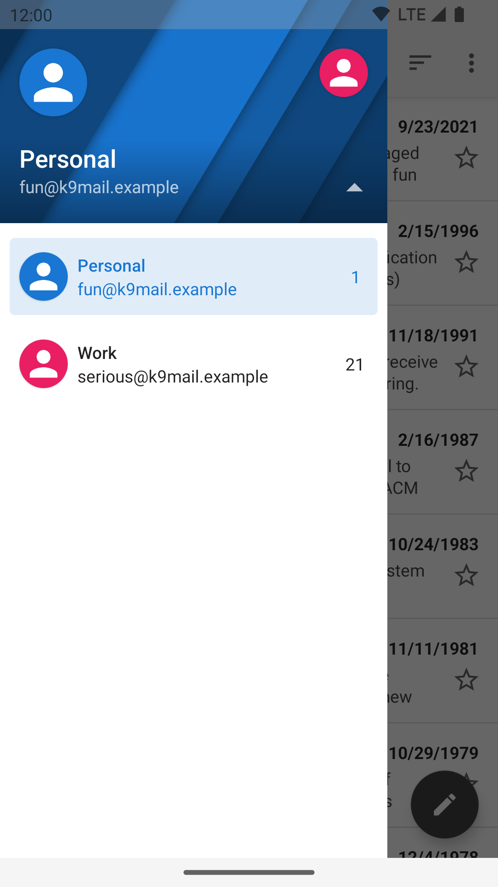

# Switching between multiple accounts

The default view is the Unified Inbox.
This shows you a combined list of the emails in all your accounts' inboxes.

To switch to a specific account, tap the drawer icon in the top left corner.

Select the chevron to expand the dropdown list of accounts

Choose an account by tapping that account's row. You can also tap the round symbol along the top.

