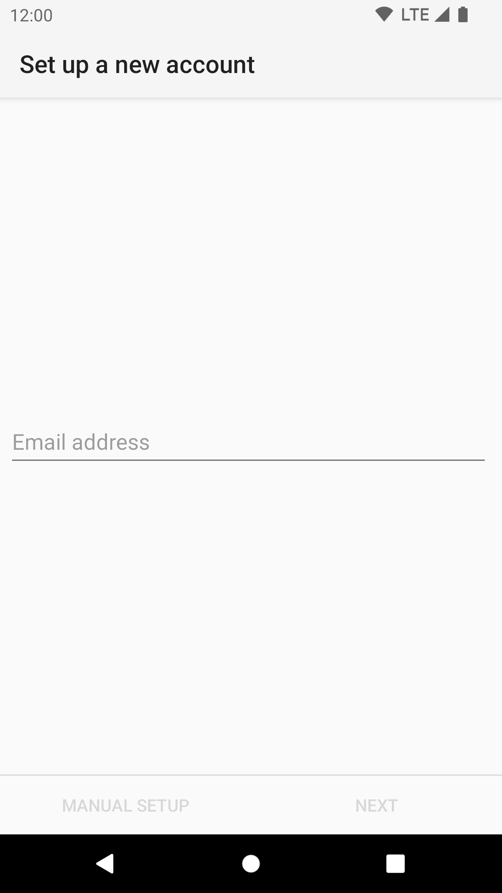
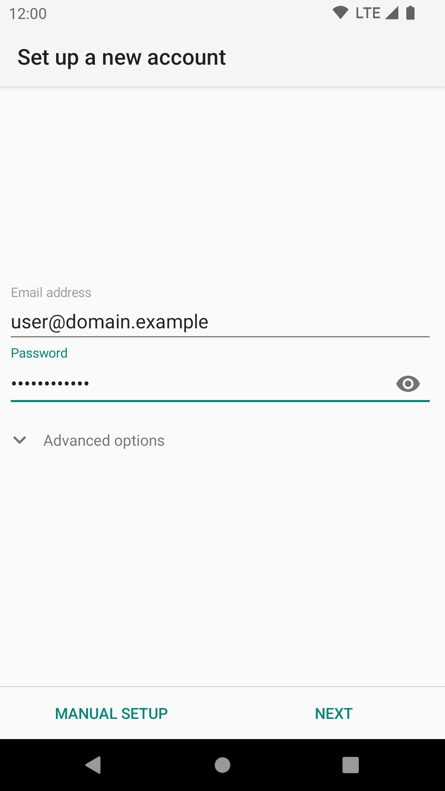
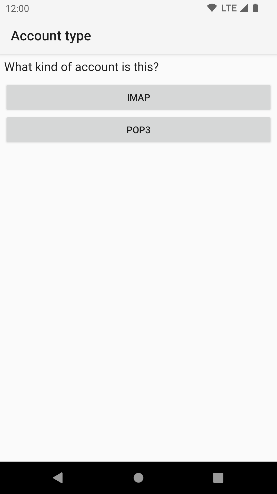

# Add an Account
The account set-up wizard will launch automatically after the [Welcome Screen](../setup/welcome.md). 

For any additional accounts they can be added by going to the accounts menu, 
and then tapping the 'Add account' option in the overflow menu.

First you are asked for your email address and password.

The buttons "Manual setup" and "Next" become only activated after a correctly formatted email address and a password
have been typed in.

 

If you choose "Next" and the domain part of your email address is known to K-9 Mail, the connection settings for the 
incoming and outgoing server are automatically set up for you. This is the case for some large email providers, 
e.g. Gmail, Yahoo!, and AOL.

We also list information on the settings for major e-mail providers [in the FAQ](https://forum.k9mail.app/c/faq/6).

## Account Type

If you need to configure it manually, you will need to first choose an account type.
The available options are POP3 and IMAP.

All of these are names of protocols to access your mailbox. If your email provider supports it, we strongly recommend 
you use IMAP. It is superior to the others and well supported by K-9 Mail.

For more information see the linked Wikipedia entries:

* [IMAP](https://en.wikipedia.org/wiki/Internet_Message_Access_Protocol)
* [POP3](https://en.wikipedia.org/wiki/Post_Office_Protocol)

## Incoming Server Settings

To configure your incoming server settings see the corresponding page

* [IMAP](incoming_imap.md)
* [POP3](incoming_pop3.md)