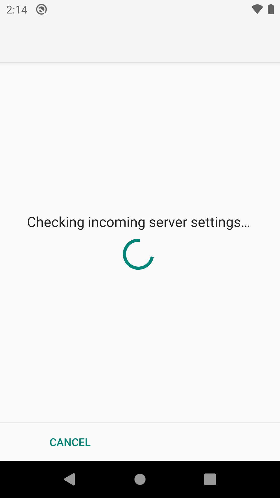
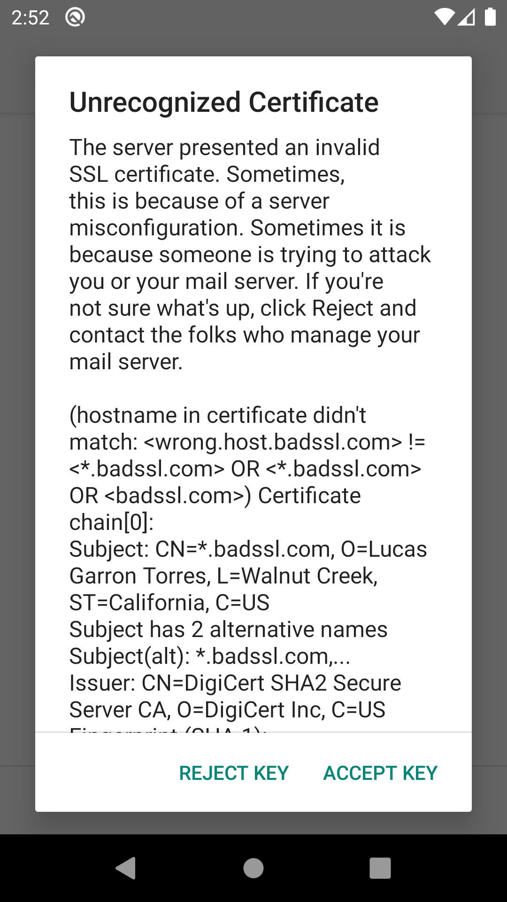

# IMAP Server Settings

The following images show all the IMAP related settings.
Later we describe them in detail.  Note that on a smartphone, your popped-up soft keyboard may be 
covering some of these entry fields; don't forget to scroll.

&nbsp;

**IMAP server**: This is the hostname or IP address of your IMAP server. Note that this address must resolve to your 
mail server no matter what network you're connected to -- if you provide a name or IP that's only resolvable *inside 
your private network*, that's the only place you'll be able to pick up email. (If you don't understand the preceding, 
then you probably don't need to worry about it.) Some firewalls can also cause trouble here.

**Security**: This specifies the cryptographic protocol that should be used when connecting to your IMAP server. 
Available options are:

* None: This doesn't use any transport security at all.
* STARTTLS: The STARTTLS method is used.
* SSL/TLS: TLS is used.

TLS and STARTTLS are both secure so it does not matter which you use, as long as it is supported by
your mail provider. However TLS is now much more common.

**Port**: This is the port number the IMAP server is listening on. Most of the time you don't want to change this. It
will generally be:

* **143** for non-encrypted or STARTTLS connections, and
* **993** for TLS.

If your port number is something else, the mail server administrator should have told you.

**Username**: This is the username that's needed to authenticate to the IMAP server. The field is initialized with the
user part of your email address. Some servers are okay with this; some, generally those which support multiple domains,
require that you fill in your entire email address here. In this case, if you entered the entire email address on the
previous screen, you will need to re-enter the hostname part here, as K-9 Mail doesn't know whether you need it and
assumes you don't.

**Authentication**: This specifies which authentication method to use after you have a valid, hopefully encrypted, 
connection. Available options are:

* **Normal password**: The password is transmitted in plain text.
If the connection security is TLS or STARTTLS, the password is still protected against eavesdroppers.
* **Encrypted password**: Use this if your server doesn't support transport security but supports the CRAM_MD5 authentication
method.
* **Client certificate**: Use this if the service supports authentication using the client certificate from the TLS connection.
If the server requires *both* certificate and password, choose one of the "Password" options here.
* **Password, transmitted insecurely**: (Only displayed if Security is "None") Use only as a last resort. The password will be transmitted without any encryption.

**Password**: Here you enter the password to access your emails. The password you entered at the first step of the
account creation process is pre-entered here. So you shouldn't need to change it. This password is the one which an
administrator set for you or gave to you, which you use to retrieve mail from the mailbox.

**Client certificate**: If the server expects a TLS client certificate to be provided during the initial connection,
use this to select one from the local Android certificate store.

**Auto-detect IMAP namespace**: Disable this to allow the IMAP path prefix to be specified manually.

**IMAP path prefix**: The content of this field is prepended to IMAP folder names before use. The main usage is to 
manually select which IMAP namespace to use. This can be automatically guessed, so usually,
you don't need to change this.

**Use compression on network**: If your server supports compression (DEFLATE) it is used on the selected networks to
minimize the amount of data transferred. Selecting this, even if your server doesn't support compression, doesn't cause
problems. So there should be no need to change these.

After clicking "Next" K-9 Mail tries to connect to the server to verify the settings. This means you need to have a 
working network connection to continue the setup.

If the server has an invalid certificate (e.g. self-signed) then at this point you can inspect the certificate
and choose to accept it permanently. Check with your mail provider before accepting the certificate, since
this could indicate an attempt to tamper with your mail connection.

After the server settings are checked you can now continue to 
[configure the outgoing server](outgoing.md).
