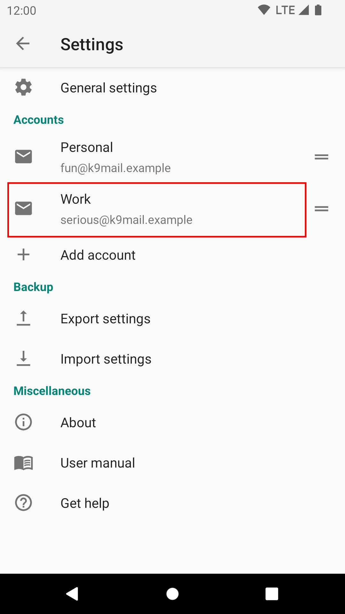

# Removing an Account

To remove an email account from K-9 Mail do the following:

Open the settings screen:

Select the account that you want to delete:

Select "Add account":

Select the menu icon in the top corner:

Select the option "Remove account".

Press "OK" to confirm the removal. This cannot be undone.

If you remove the only account, you will return to the initial welcome screen and be prompted
to set up a new account.
