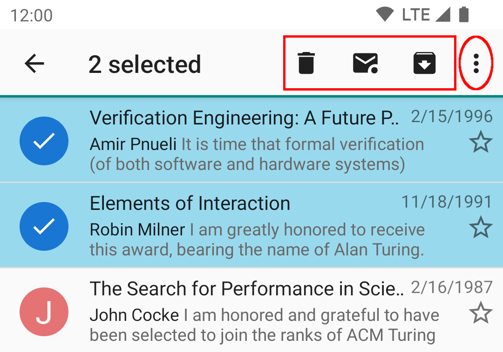

# Managing mail

## Selecting more than one message at a time

Tap the contact icon on the left of the message to select one or more messages.

When one or more messages are selected, actions appear in the Action Bar at the top. There is also
an overflow menu, so some of the actions might require you to tap the right hand menu icon (circled below.)
If you are unsure of the meaning of an icon, you can safely long-press it to show a tooltip.

The icons have the following meanings:

<table>
<tr>
<td>  </td><td>Delete </td> 
</tr>
<tr>
<td>  </td><td>Mark as read</td> 
</tr>
<tr>
<td>  </td><td>Mark as unread</td> 
</tr>
<tr>
<td>  </td><td>Move the selected message(s) to the configured Archive folder</td> 
</tr>
</table>

## Message Actions

Some actions are available only within the single message view, others are always available when message(s) are selected.

* Delete - delete the message (move it to the Trash folder)
* Mark unread - unset the Message Read flag
* Archive - moving the message to the Archive folder
* Move - present a list of folders in the current email account to which the message can be moved; do so if one is selected
* Copy - present a list of folders in the current email account to which the message can be copied; do so if one is selected
* Add Star - Mark the message as 'special' (\Flagged in IMAP, for example)
* Spam - move the message to the Spam folder
* Select All - select all messages in the folder
* Reply - Compose a reply only to the sender
* Reply All - Compose a reply to the sender and all other recipients
* Forward - Forward the message by email
* Forward as attachment - Forward the message by email as an attachment
* Edit as new message
* Share - pass the message body to the Android Sharing facility, so the user can share it with someone in some way other than an email forward
* Send Again - Attempt to send this message again (usually used from the Sent folder)
* Show Headers
* Compose

## Keyboard Navigation

| Shortcut        | Message List      | Message Details |
| --------------- | ----------------- | --------------- |
| **Del**         | delete            | delete          |
| **Volume up**   | next message¹     | next message¹   |
| **Volume down** | prev message¹     | prev message¹   |
| **Back**        | managed back²     | managed back²   |
| **a**           | reply-all         | reply-all       |
| **c**           | compose           |                 |
| **d**           | delete            | delete          |
| **f**           | forward           | forward         |
| **g**           | toggle flag       | toggle flag     |
| **h**           | show keys help    | show keys help  |
| **i**           | toggle sort order |                 |
| **j**           |                   | prev message    |
| **k**           |                   | next message    |
| **m**           | move              | move            |
| **n**           |                   | next message    |
| **p**           |                   | prev message    |
| **q**           | up-to folder list |                 |
| **r**           | reply             | reply           |
| **o**           | cycle sort key    |                 |
| **s**           | toggle selected   | move-to-spam    |
| **u**           | mark as unread    | mark as unread  |
| **v**           | archive           | archive         |
| **y**           | copy              | copy            |
| **shift-z**     |                   | zoom in         |
| **z**           | toggle read       | zoom out        |

¹ if manage volume keys is turned on
² if manage back button is turned on