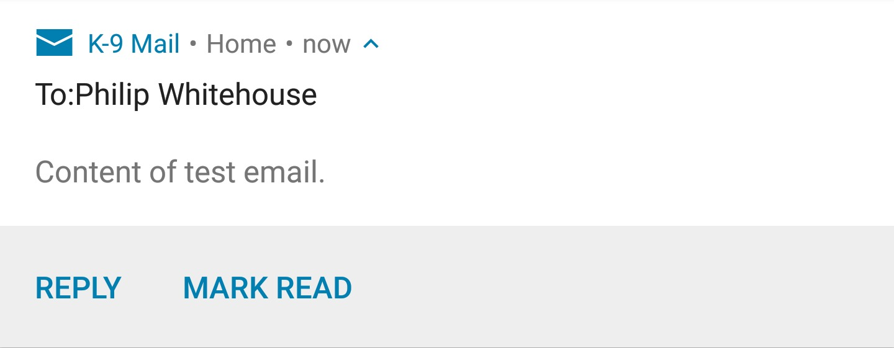
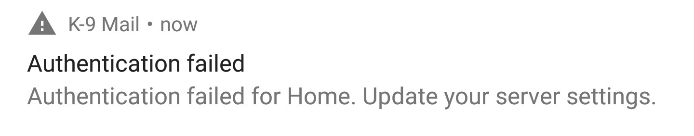

# Notifications

Notifications are a key part of any communications tool and K-9 has, through it's development put considerable effort 
into designing a notifications system that both accommodates users and and works as well as possible across a broad 
range of devices.

In this section, the use of notifications by K-9 is documented.

## New Mail Notifications

The most commonly seen notification is the new mail notification.

A single new mail notification will appear as a simple notification, showing the sender, the subject and the start of 
the email. Actions are provided which are (by default):

* Reply
* Mark Read
* Delete

Multiple emails to the same account are collapsed, stacked into a single notification, showing the sender and the 
subject. Dragging down on the stacked notification expands the unread emails into separate notifications, which then 
function as described above.

Tapping on the stacked notification clears it and either opens the Inbox for that account or displays the Unified Inbox (if enabled).

Tapping on an individual email's notification clears it and opens that email.

## Error Notifications

If (for example) an account's password changes and K-9 can no longer receive email, a notification will be created 
informing you of the authentication failure.

Tapping on the notification will open the Incoming Server settings screen to correct the problem.
