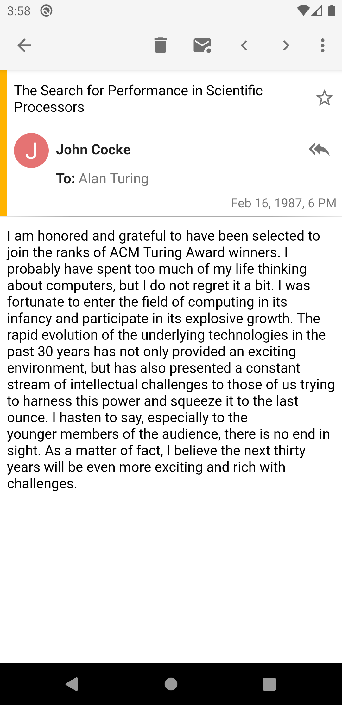
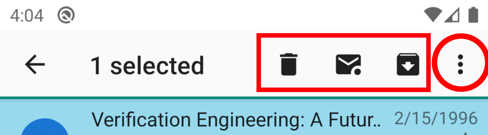

# Reading E-mail

## Fetching E-mail

When you receive new mail, K-9 retrieves it (POP3) or polls for it or receives a push notification about it
(IMAP).  If so configured, K-9 uses Android's notification system to alert you to the new messages.

#### Sync Types & K-9 Behavior

There are two ways of being notified of new mail synchronized to your device, Push and Poll.

- "Push" means that the server notifies K-9 of new email. This is immediate, therefore
the best choice if you want to be notified as soon as you have new mail. Unfortunately due to
Android battery optimizations and unreliable networks, it does not always work.
- "Poll" means K-9 periodically checks the server to see if new mail exists.

Your choice of Push or Poll applies to each Folder Class within an account, rather than at the account level.

You can also manually synchronize an account. In this case, K-9 polls all subscribed folders.

Various actions within K-9 may cause it to perform an additional poll to ensure that the state is
consistent before/after they perform the action.

## Browsing E-mail

 

At this point, you're looking at a Message List -- a list of all (or only the unread) messages in a given folder; in 
this case, the Inbox folder for that email account.  This list displays:

* message subject lines (in *bold* if not yet read, highlighted if not fully downloaded),
* a time or date (depending on the age of the message), and 
* either the sender's email address or "real name".  
   
It also displays by default:

* a short preview of the body text of the message 
* a star icon for flagging messages 
  
These options can be enabled or disabled in Global Settings->Display->Message lists.

Threads of messages are by default collapsed into a single row, which you can tap to expand to show a list
of messages in that thread. If you don't like this, you can turn it off in 
Global Settings->Display->Message lists->Threaded view.

At this point, you can:

* tap on a message in the list to open it for reading, or 
* tap the contact icon on the left of the message to select one or more messages.

When one or more messages are selected, actions appear in the Action Bar at the top. There is also
an overflow menu, so some of the actions might require you to tap the right hand menu icon (circled below.)
If you are unsure of the meaning of an icon, you can safely long-press it to show a tooltip.

### Message Actions

Some actions are available only within the single message view, others are always available when message(s) are selected. 

* Delete - delete the message (move it to the Trash folder)
* Mark unread - unset the Message Read flag  
* Archive - moving the message to the Archive folder
* Move - present a list of folders in the current email account to which the message can be moved; do so if one is selected
* Copy - present a list of folders in the current email account to which the message can be copied; do so if one is selected
* Add Star - Mark the message as 'special' (\Flagged in IMAP, for example)
* Spam - move the message to the Spam folder
* Select All - select all messages in the folder
* Reply - Compose a reply only to the sender
* Reply All - Compose a reply to the sender and all other recipients
* Forward - Forward the message by email
* Forward as attachment - Forward the message by email as an attachment
* Edit as new message
* Share - pass the message body to the Android Sharing facility, so the user can share it with someone in some way other than an email forward
* Send Again - Attempt to send this message again (usually used from the Sent folder)
* Show Headers
* Compose
