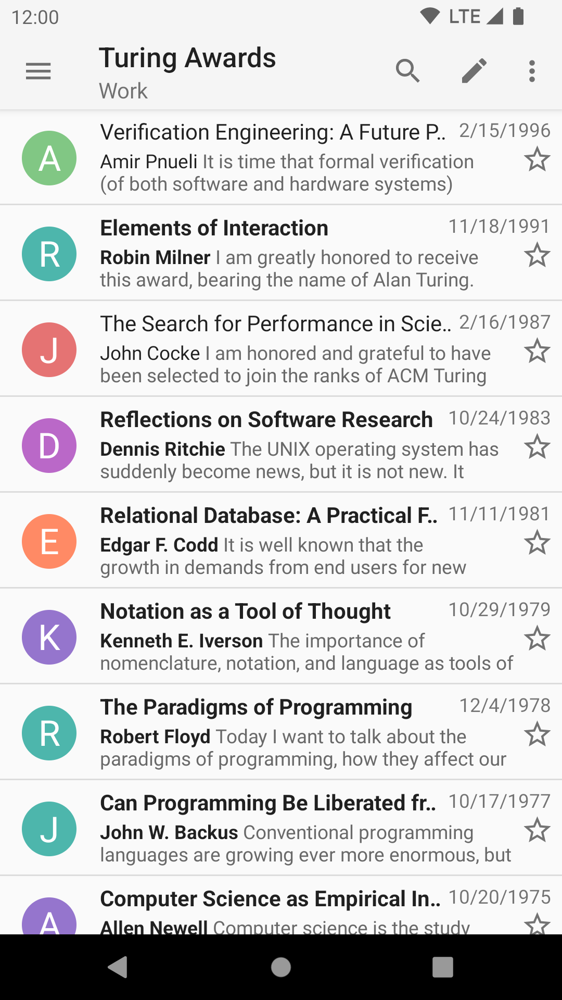
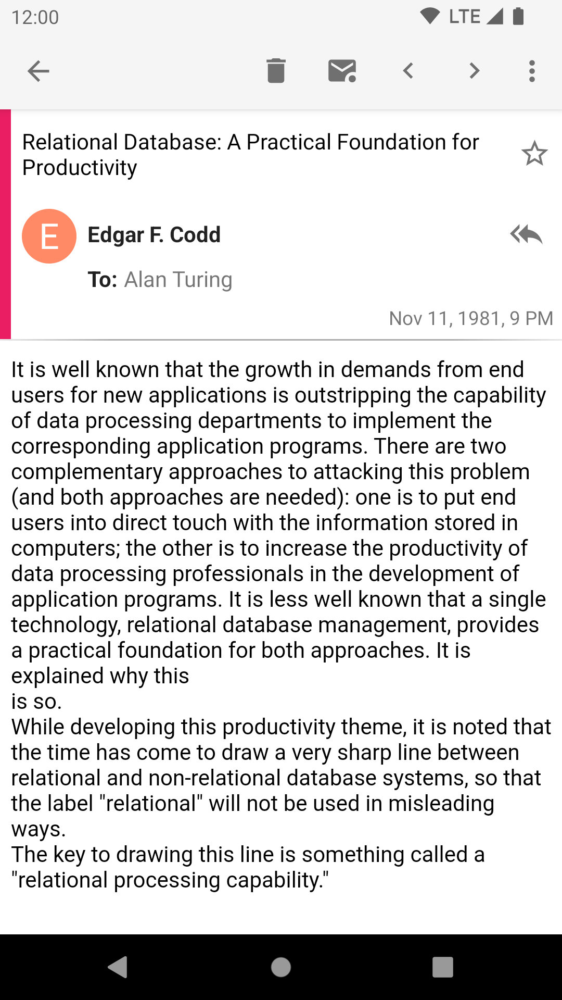

# Reading E-mail

## Fetching E-mail

When you receive new mail, K-9 retrieves it (POP3) or polls for it or receives a push notification about it
(IMAP).  If so configured, K-9 uses Android's notification system to alert you to the new messages.

## Browsing E-mail

At this point, you're looking at a Message List -- a list of all (or only the unread) messages in a given folder; in 
this case, the Inbox folder for that email account.  This list displays:

* message subject lines (in *bold* if not yet read, highlighted if not fully downloaded),
* a time or date (depending on the age of the message), and 
* either the sender's email address or "real name".  
   
It also displays by default:

* a short preview of the body text of the message 
* a star icon for flagging messages 
  
These options can be enabled or disabled in Global Settings->Display->Message lists.

Threads of messages are by default collapsed into a single row, which you can tap to expand to show a list
of messages in that thread. If you don't like this, you can turn it off in 
Global Settings->Display->Message lists->Threaded view.

At this point you can tap on a message in the list to open it for reading.

When in an email, you can pinch-to-zoom. From versions 6.300 and on, you can also swipe right (or left) to 
move to the next (or previous) message.

<video width="50%" controls>
  <source src="../img/reading_pinch_swipe.mp4" type="video/mp4">
  <source src="../img/reading_pinch_swipe.ogg" type="video/ogg">
  Your browser does not support the video tag.
</video>
