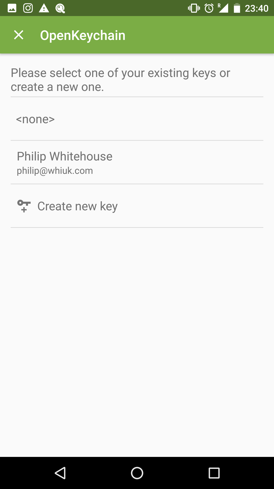
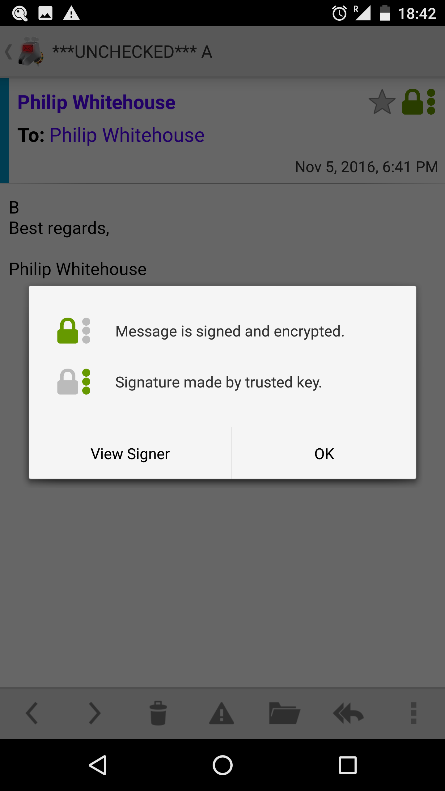
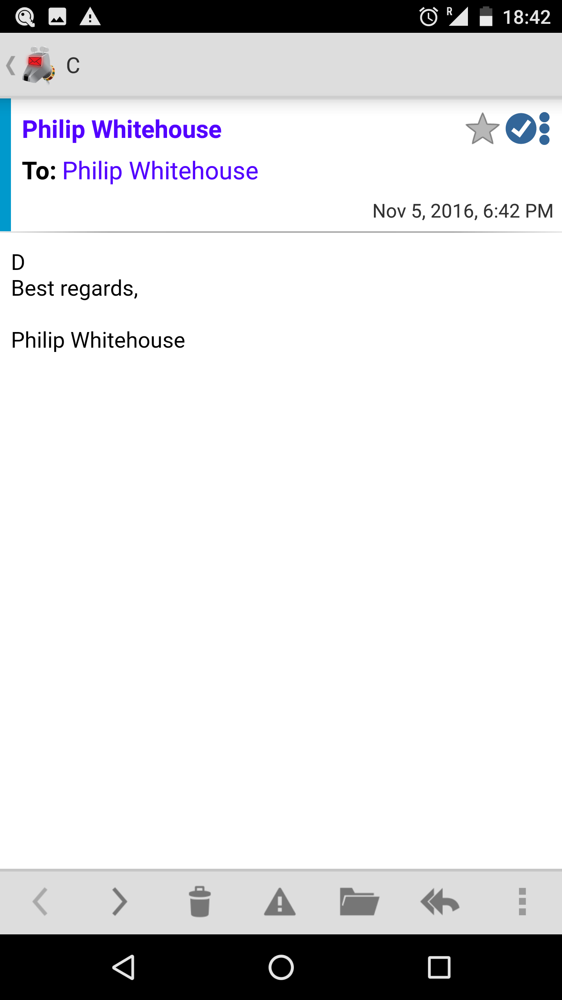

# PGP End-to-end encryption

K-9 Mail does not have built-in encryption capabilities. Instead, it uses an external Android application called
[OpenKeychain](https://www.openkeychain.org/).

## OpenKeychain Usage

### Selecting OpenKeychain as a Crypto Provider

To start using PGP you first need to link OpenKeychain with K-9. To do this:

* Install OpenKeychain from wherever you get your apps
* In K-9, Select Settings -> Accounts
* Choose the account for encryption
* Select End-to-end encryption
* Enable OpenPGP support

## Selecting a Key

Now you'll need to select a key. Click the 'Configure end-to-end key' option.

You'll be sent a screen in the OpenKeychain app:

Select either a key you've already imported/created or create a new key:

See the [OpenKeychain](https://www.openkeychain.org/) website for more information on creating and managing keys.

### Signing & Encrypting Mail

When composing e-mail after OpenKeychain has been set up, a new padlock icon
appears in the top right of the composition screen:

(If the icon does not appear, it means that OpenKeychain does not know the PGP keys of any of the recipients)

Tapping the icon enables encryption and turns it green:

For more details on this icon, see [Editing Email Content](../sending/sending_content.md#encryption).

### Decrypting & Verifying Signed Mail

When viewing encrypted mail, once configured, K-9 will automatically use OpenKeychain to try to decrypt it with your
key and check the signature.

For encrypted and trusted signed messages it will look like this.

Tapping on the green lock icon brings up this modal:

#### Signed but unencrypted emails

K-9 only allows you to send mails that are *both* encrypted and signed. Some other mailers
allow the sender to sign the message, which proves it was sent by them, but without encrypting it.
(This is sometimes useful e.g. in public mailing lists)

For trusted signed messages K-9 will look like this.

And tapping on the icon brings up this:

Tapping on the 'View Signer' option will open the contact in OpenKeychain.

