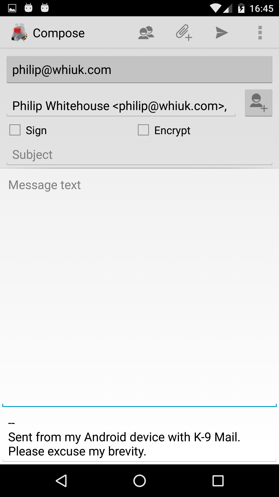
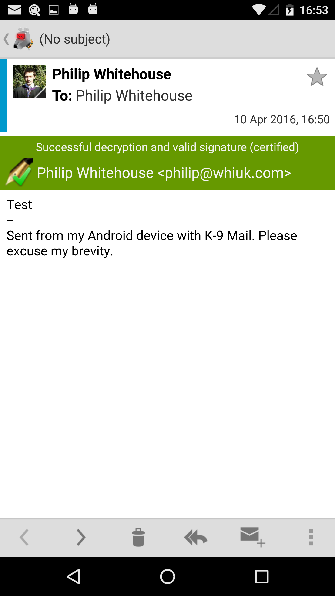

## Pre 5.2x PGP Integration

### Signing & Encrypting Mail

When an OpenPGP provider has been set-up in the [account settings](../settings/account.md) a new set of options are 
shown in the message compose window:

Selecting Sign and Encrypt accordingly allows e-mails to be sent in a verified and secure way (respectively).

### Decrypting & Verifying Signed Mail

Decryption and verification of e-mail is done automatically and corresponding header is shown when viewing the e-mail:

