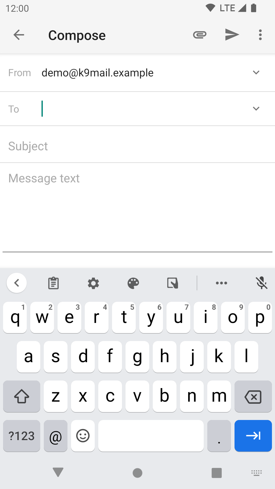
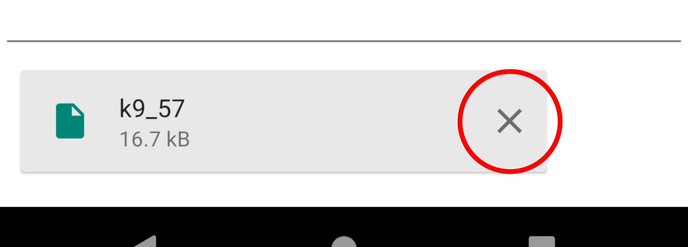
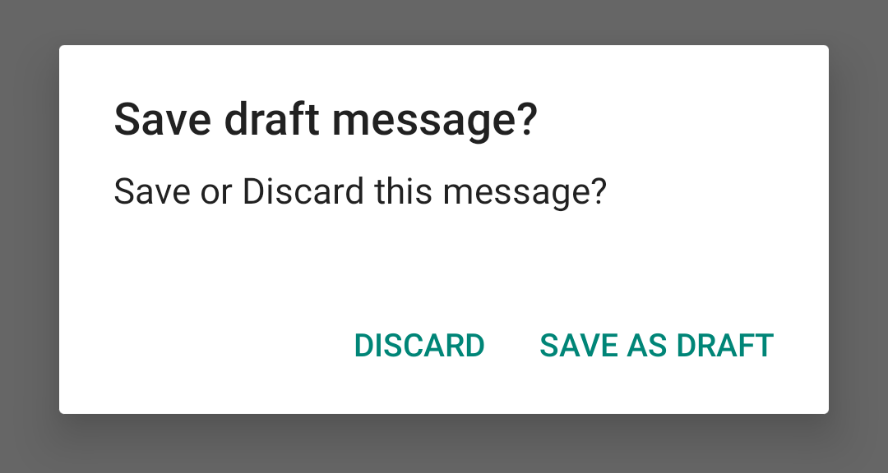
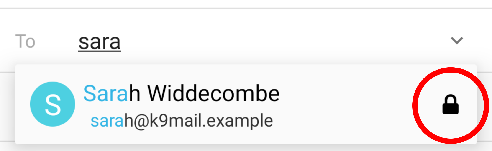
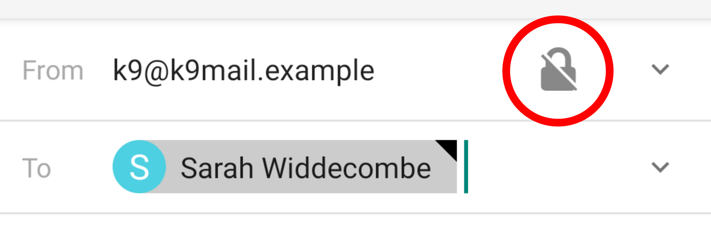
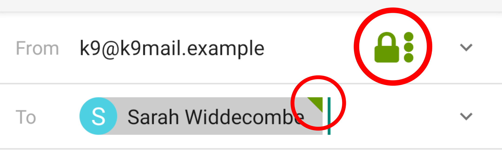
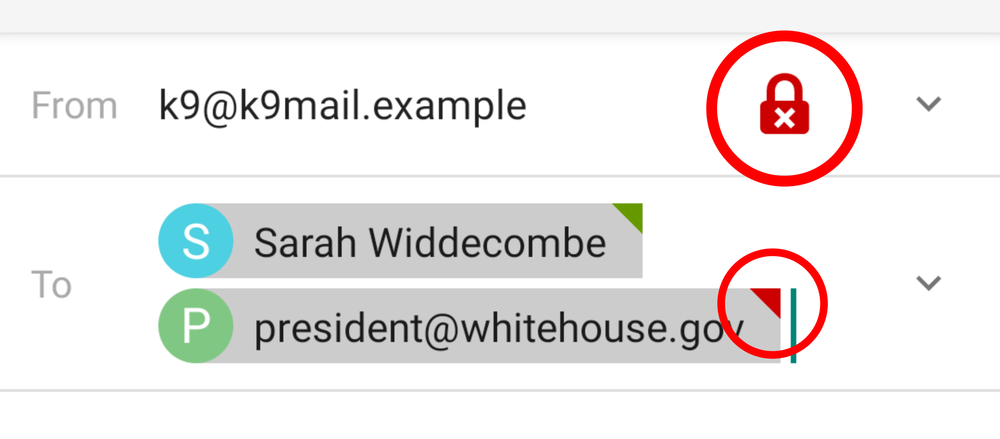

# Editing E-mail Content

## From address

This is usually your own email address.

If you have multiple accounts, K-9 automatically populates the From address based on which folder you're
currently in. If you're in the Unified Inbox, it uses the first account.

You can change the account or [identity](../settings/account.md#manage-identities) from which the
new email will be sent by tapping the email address.

You can set a 'Reply-To' header by tapping the drop-down on the right of the From address. Most recipient
mail clients will use this email address when replying to your email, instead of the From address.

## To address

This is automatically populated if you're replying to an email.

You can type an email address into this box if you know it exactly. K-9 will simultaneously search
your contacts for matching names, nicknames, and email addresses. If you choose one of the suggestions,
that will replace what you have typed.

To add multiple recipients, tap into the box again and start typing again.

To delete a recipient, tap the recipient and then the delete button in the popup.

You can also press backspace on the keyboard to delete the recipient before the cursor.

### CC address

The internet email standards allow a CC (Carbon Copy) header. Functionally this is the same as adding recipients to the To
header: everyone listed on the To and CC headers will receive a copy of the email.

You can display the CC field by tapping the down arrow next to the To field.

CC is often used to indicate to the recipient that the email is only for information and does not
require any action.

### BCC address

BCC (Blind Carbon Copy) lets you add additional recipients to an email, that will not be shown to the
normal recipients in the To and CC headers. They will see only the other recipients in the To and CC headers.

## Attaching files

Tapping the file attachment icon opens Android's system file picker for you to attach a file. 

Existing attachments are shown at the bottom of the screen. If you change your mind you can remove 
the attachment using the cross on the right.

A large attachment may take a while to load. In this case a loading icon is displayed. You must
wait for the loading to complete before sending your message.

## Saving as draft

K-9 will save your message in the remote Drafts folder if you press the back button and choose 'Safe as Draft',
or choose the 'Save as Draft' menu option.

To get back to your draft message, choose the message from within the account's Draft folder.

A draft is also created when you switch away from the K-9 application. 

## Signature

At the bottom of the message text the default signature is shown. This can be changed in
[Settings/Account Settings/Manage identities/*Identity*/Signature](../settings/account.md#signature).

## Read Receipt

You can give your recipient the choice to send you back a 'read receipt', to indicate that they have read your email.
Choose the 'Read receipt' menu option.

Do not rely on read receipts, because:

* Not all email clients recognise read receipts.
* The recipient might decline to send you a read receipt.
* The read receipt is itself an email, which could be lost.

> K-9 does not send Read Receipts in the other direction, i.e. when receiving emails that request a read receipt.

## Encryption

If the recipient's key is available, the padlock icon will be shown next to the contact name:

Once you've added all recipients, to encrypt (and sign) the email, tap the padlock icon.

The icon will change to green to indicate encryption will be enabled for this message.

If you add another recipient whose key is not available, the encryption icon will turn red. Invalid
recipients for encryption are indicated by a red marker in the corner.

If the icon is not present at all, try deleting any recipients that do not have a key.

For more information, including on how to set up encryption at first, see [PGP](../security/pgp.md)