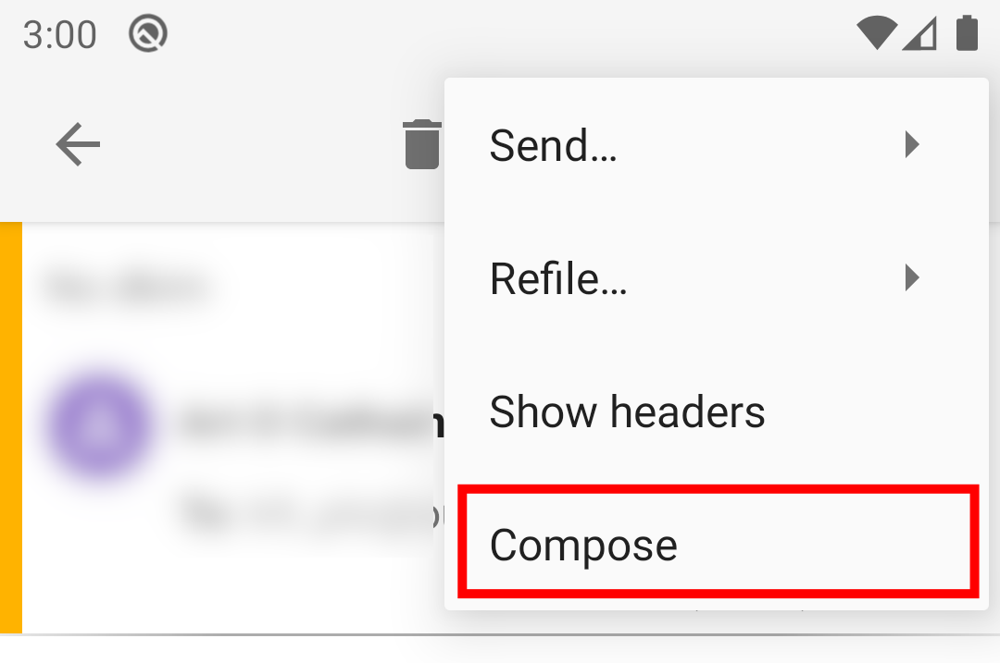
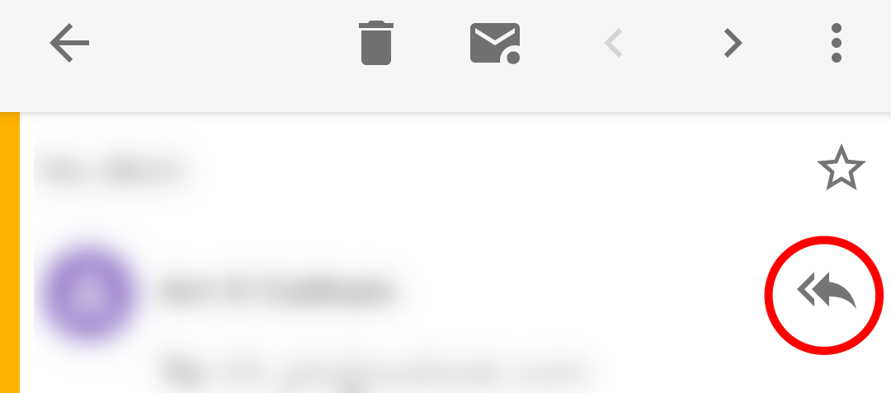

# Starting to Compose an E-mail

You can send an email from several start points:

## Compose button

This is visible when you a viewing a list of messages:

## Compose menu option

This is available from the overflow menu when you are viewing a single message:

## Via another Android app

For example, when you view a contact in the Contacts app, you can send an email to that contact
using K-9 by tapping their email address.

Your browser can open K-9 when you tap a special type of web link called `mailto:` which is designed
to open your email client and autofill the address(es), subject, and email body.

## Replying

You can send a message based on an existing message using one of the options in the reply menu

### Reply

This will compose a message to the sender and quote the existing message.

If the message has a 'Reply-To' header, this will be used as the recipient of the reply.

Many mailing lists include a 'List-Post' header. This is the destination address to use when sending
messages to the list. K-9 will use it, if present.

If the subject line does not start with "re:", then "Re:" will be preprended to the subject.

### Reply all

This will compose a message to the sender and quote the existing message. It will add all other
recipients visible in the Reply-To, From, and CC headers.

### Forward

This will compose a message and quote the existing message. The recipient is left empty for you to fill in.

If the subject line does not start with "fwd:", then "Fwd: will be preprended to the subject.

### Forward as attachment

This will compose a message and attach the existing message as an `.eml` file. EML is an internet
standard for sharing emails as files, recognised by major mail clients such as Microsoft Outlook.
