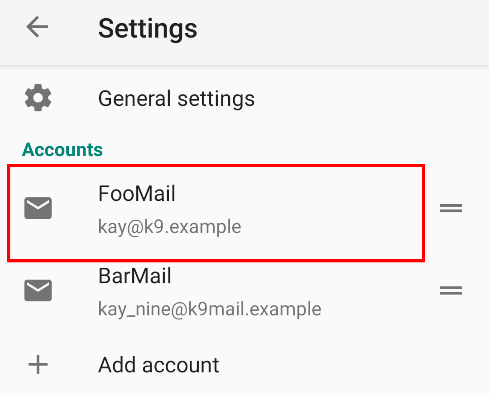
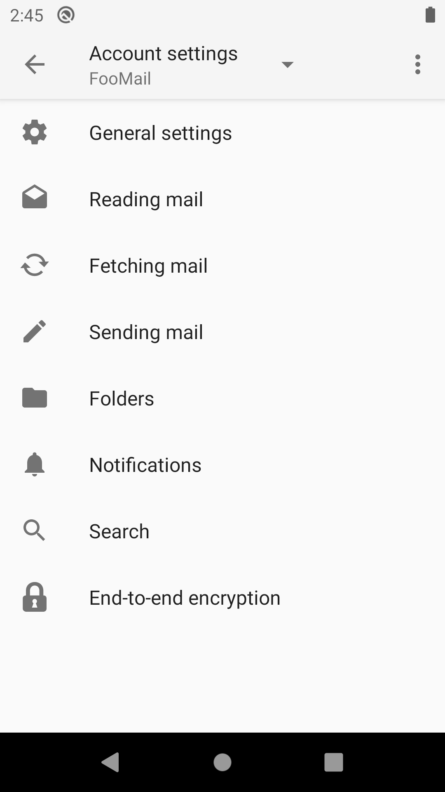
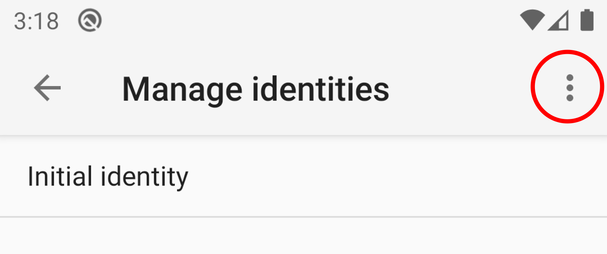
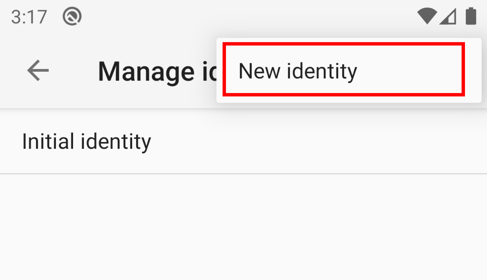

# Account Settings

Many of the settings in K-9 Mail can be customized for each account, and are therefore located under *Account Settings*.

From Settings, each account's settings can be reached from the account list by tapping the account name:

(The = sign on the right of each account lets you drag the account up or down to change the display order.)

## General Settings

### Account name
Here you can specify the name of the account that is displayed in the account list screen.

### Account color
Here you can select the color that is used to indicate that a particular message (or folder) belongs to the selected 
account.

## Reading mail

### Always show images
This setting allows you to control when images are automatically downloaded and displayed in the message view and when 
you have to press the *Show pictures* button first.

Available options:

* No (Always display the *Show pictures* button)
* From contacts (Display images automatically if the sender is in your Contacts)
* From anyone (Never display the *Show pictures* button)

### Mark as read when opened
Check this to mark messages as read when you open them (the default). 

Independent of what you select here, you can always select *Mark as read* or *Mark unread* from the menu when viewing a 
message.

## Fetching mail
These settings control how and when mail is fetched for this account.

### Local folder size
Specify the number of messages that will be downloaded for a folder. When new messages are downloaded older messages 
will be deleted from the device (but not from the server).

This is no hard limit and you can download more messages by pressing *Load up to XX more* at the end of the message list.

### Sync messages from
If you set this to anything other than *any time (no limit)*, K-9 Mail will only download messages that are newer than 
a certain time span. During synchronization K-9 Mail will remove previously downloaded messages that fall outside that 
range from the device (but not the server).

**Note:** Currently, pressing *Load up to XX more* in the message list doesn't override this setting. That means you 
won't be able to manually fetch messages older than specified here.

**Note:** This setting is only available for IMAP accounts.

### Fetch messages up to
Set a limit on how much of a message is downloaded during synchronization. When viewing messages larger than this value 
you will see a button saying *Download complete message* that allows you to download the rest of the message.

### Folder poll frequency
Control the poll frequency from "never" (do not poll at all), up to 24 hours.

### Poll folders
Control whether to poll all, 1st Class, 2nd Class or no folders at all.

To learn more about this, read the page [Folder classes](folder_classes.md).

### Push folders
Control whether to push all, 1st class, 2nd class or no folders.

To learn more about this, read the page [Folder classes](folder_classes.md).

**Note:** This setting is only available for IMAP accounts, because it's the only account type that supports Push.

### Sync server deletions
By default K-9 Mail removes downloaded messages from the device if the message has been deleted from the server. If you 
uncheck this setting K-9 Mail will keep the downloaded messages.

### Mark as read when deleted

Self-explanatory.

### When I delete a message
You can control what happens when you delete a message using K-9 Mail.

The following options are available:

* Do not delete on server (only from the device)
* Delete from server
* Mark as read on server (not available for POP3 accounts)

### Erase deleted messages on server
Normally, messages on the server are simply marked for deletion. Here you can control when they are actually deleted 
(expunged).

Available options:

* Immediately
* When polling
* Manually

**Note:** Some clients can display messages that are marked for deletion and allow you to remove that flag, undeleting 
them. K-9 Mail currently doesn't support that functionality.

**Note:** This setting is only available for IMAP accounts.

### Incoming server

Please see [Incoming Server Settings](../accounts/add.md#incoming-server-settings) for the available settings.

### Advanced

K-9 Mail supports some advanced settings for IMAP accounts. If you're not familiar with the details of the IMAP 
protocol you shouldn't change any of these settings. 

#### Poll when connecting for push
When this is enabled, K-9 Mail will do a full folder synchronization after establishing a Push connection. Otherwise it 
will only download new messages.

#### Max folders to check with push
K-9 Mail needs to establish one connection for each folder that is checked via Push. This can quickly add up and exceed 
the number of concurrent connections your mail server allows you to establish.
This setting is intended as safety mechanism to limit the number of Push connections regardless of how many folders are 
configured to be checked via Push.

#### Refresh IDLE connection

This controls how often K-9 refreshes the IDLE connection used in Push. In theory this should never
be necessary but sometimes networks break the connection, causing you to miss notifications. 
Lowering the value here will mitigate that problem, at the cost of reduced battery life.

## Sending mail
These settings control everything related to sending mail.

### Composition defaults
Here you can configure your main identity.

#### Your name
This is the name that will be used in outgoing messages.

#### Your email address
This is the email address that will be used as the sending address for outgoing messages.

#### Bcc all messages to
Here you enter an email address that will receive a copy of all messages you send.

#### Use signature
Enable this to add a signature to all your messages.

#### Signature
Enter the signature text here.

**Note:** You should start the signature with "-- " (dash, dash, space) on its own line. Most email clients will 
recognize this as start of the signature and e.g. allow stripping the signature when quoting messages in replies.

#### Signature position
Here you can specify where your signature should appear when replying to a message.

Available options are:

* Before quoted text (your text, your signature, quoted text)
* After quoted text (your text, quoted text, your signature)

**Note:** This setting will be ignored if you check the setting *Reply after quoted text*.

### Manage identities
Here you can set up alternative identities consisting of name, email address, *Reply-to* address, and signature.

At first it will show a list with the single "initial identity".

Use the menu in the top right to add another:

#### Delete an identity
Long-press the name of an identity in the list of identities, then select *Remove*.

#### Set default identity
Long-press the name of an identity in the list of identities to open a menu that allows you to change the order of 
identities (*Move up*, *Move down*, *Move to top / make default*). The top-most identity is the default identity that 
will be used when composing a message from this account.

### Message Format
Here you can configure the message format that is used for outgoing messages.

The following options are available:

* Plain text (you will lose all formatting and inline images of the original message when forwarding/replying to a 
  message; this will only send text/plain parts)
* HTML (keeps images and formatting; will additionally include a text/plain part)
* Automatic (same as *Plain text* when composing new messages; same as *HTML* when replying or forwarding messages)

### Always show Cc/Bcc
Enabling this will always show the text fields to specify CC and BCC recipients in the message composition screen.

### Read receipt
Checking this requests a read receipt for all outgoing messages.

See [Editing E-mail Content/Read Receipt](../sending/sending_content.md#read-receipt) for more information.

### Reply quoting style
Defines your preference for the format in which the quoted text of the message you are replying to will appear from the 
following options:

* Prefix (like Gmail) - The quoted text appears below a one line header in the format 
  `Sender's Name <user@domain.TLD> wrote:`.  
  With the prefix option selected 2 additional options are available:
    * Reply after quoted text - When enabled, the original message appears above the reply you type into the message
      text box.
    * Quoted text prefix - Defines the character(s) that precedes each line of quoted text. The default is '>'. 
* Header (like Outlook) - The quoted text appears below a header that includes the Original Sender,
  Recipients, Time, and Subject from the original email's message header fields.

### Quote message when replying
Uncheck this if by default you don't want to include the original message in your reply. You will still be able to 
include the original message by clicking the *Quote message* button in the message composition screen when replying to 
a message.

### Strip signatures on reply
When this is enabled, K-9 Mail will try to detect the correspondent's signature and remove it when quoting the original 
message.

### Upload sent messages

Upload sent messages to your account's Sent folder if the send was successful.

### Outgoing server

Please see [Configuring the outgoing server](../accounts/outgoing.md#configuring-the-outgoing-server) for the available 
settings.

## Folders

### Auto-expand folder
The folder you specify here will be opened when you select an account in the drawer.

When this option is set to *NONE*, opening an account via the drawer will leave the drawer open
and display the folder list of that account, allowing you to select a folder.

### Folders to display
Here you can specify what folder classes should be displayed in the folder list. This can also be changed from the 
*Show folders...* sub-menu in the Manage Folders settings.

For details of this option see [Folder classes](folder_classes.md#display-mode).

### Move/copy destination folders
This setting specifies which folders are displayed when you're asked to pick a destination folder for copy and move 
operations.

Available options are:

* All
* Only 1st Class folders
* 1st and 2nd Class folders
* All except 2nd Class folders

To learn more about folder classes, read the page [Folder classes](folder_classes.md).

### Folders to search
Here you specify what folders are searched when you start a search from the folder list or the account list. Searches 
from a message list only search messages in that list.

Available options are:

* All
* Displayable (only folders matching *Folders to display*)
* None

### Archive folder
Here you can designate an archive folder. Messages will be moved there when the *Archive* action is used. 
Selecting *-NONE-* disables the archive functionality for this account.

**Note:** This setting is not available for POP3 accounts.

### Drafts folder
This specifies which folder is used to save message drafts. Select *NONE* to disable saving drafts.

**Note:** This setting is not available for POP3 accounts.

### Sent folder
A copy of sent messages is uploaded to this folder. Select *NONE* to disable this functionality. Please note that 
your mail server might save a copy of outgoing messages regardless.

**Note:** This setting is not available for POP3 accounts.

### Spam folder
Here you can designate a spam folder. Messages will be moved there when the *Spam* action is used. Selecting *NONE* 
disables this functionality.

Please note that K-9 Mail does not have a spam filter included. Moving messages to a special spam folder will often 
train the spam filter on your mail server. If your server doesn't support this, you might as well disable this 
functionality and just delete messages.

**Note:** This setting is not available for POP3 accounts.

### Trash folder
Messages you delete in K-9 Mail are moved to the folder you specify here. If you select *-NONE-* K-9 Mail will delete 
messages instead of moving them to a trash folder.

**Note:** This setting is not available for POP3 accounts.

## Notifications
Here you can specify whether and how you want to be notified of certain events.

### New mail notifications
Enable this if you want K-9 Mail to notify you when new (unread) messages have been downloaded.

### Notification folders
K-9 Mail will only create notifications for messages in folders whose 
[notification class](../folder/#folder-notification-class) matches this setting.

### Include outgoing mail
If this is unchecked K-9 Mail will not create notifications for downloaded messages that were sent by an address from 
one of your configured identities.

### Contacts only
Check this to limit notifications to messages from known contacts.

### Ignore chat messages
If you're using an email chat app like [Delta Chat](https://delta.chat/), you probably want to disable notifications 
for chat messages. Otherwise you might end up with notifications for the same message from both apps.

### New mail ringtone
Select a notification sound.

### Vibration
Here you can configure a vibration pattern for notifications. There are multiple patterns available. A pattern can 
be repeated up to 10 times.

**Note:** Even with this setting unchecked a notification can cause a vibration when you've configured a ringtone and 
your device is switched to vibrate. This is controlled by Android, not K-9 Mail.

### Notification light
Notifications for new messages can blink the notification light in a particular color.

The available options are:
* Disabled
* Account color
* System default color
* White
* Red
* Green
* Blue
* Yellow
* Cyan
* Magenta

**Note:** Not all devices have a notification light. Unfortunately, there is no way for an app to find out if that's the 
case. So this setting is always visible, even when you can't use it.

### Sync notifications
If this is enabled, K-9 Mail will display a notification in the status bar as long as it is checking for new mail.

### Notification categories

On Android 8 and above a notification needs to belong to a *notification category* that users can individually configure
or disable entirely.

#### Messages
This will open the system screen to configure notifications for new messages in this account.

#### Miscellaneous
This will open the system screen to configure miscellaneous notifications, like error notifications and the 
sync notification.  

**Note:** You should never disable all notifications in this category. Otherwise you might miss important error
notifications. If you only want to get rid of sync notifications, use the [*Sync notifications*](#sync-notifications) 
setting instead.

## Search
In this section you can enable and configure the behavior of server-side search.

**Note:** This is only available for IMAP accounts.

### Server search limit
Here you can specify how many search results are downloaded.

K-9 Mail will only download the headers of found messages. The message contents are only downloaded after the message 
is opened for viewing.

Available options are: 10, 25, 50, 100, 250, 500, 1000, All.

## End-to-end encryption

This section allows you to select a cryptography provider that allows you to encrypt and decrypt messages using 
the OpenPGP standard.

**Note:** Currently only [OpenKeychain](https://www.openkeychain.org/) is supported as a crypto provider. Check the 
  [PGP/MIME](../security/pgp.md) section for details on how to use it.

### OpenPGP Provider
This allows you to select the crypto provider to use. Right now the only options are *None*, *APG* and *OpenKeychain*

### Auto-sign
Enable this if you want to sign all messages sent with K-9 Mail. You will still be able to override this on a 
case-by-case basis in the screen to compose a message.

### Auto-encrypt
Enable this if you want to encrypt all messages sent to a contact you have a public key for. You will still be able to 
override this on a case-by-case basis in the screen to compose a message.
