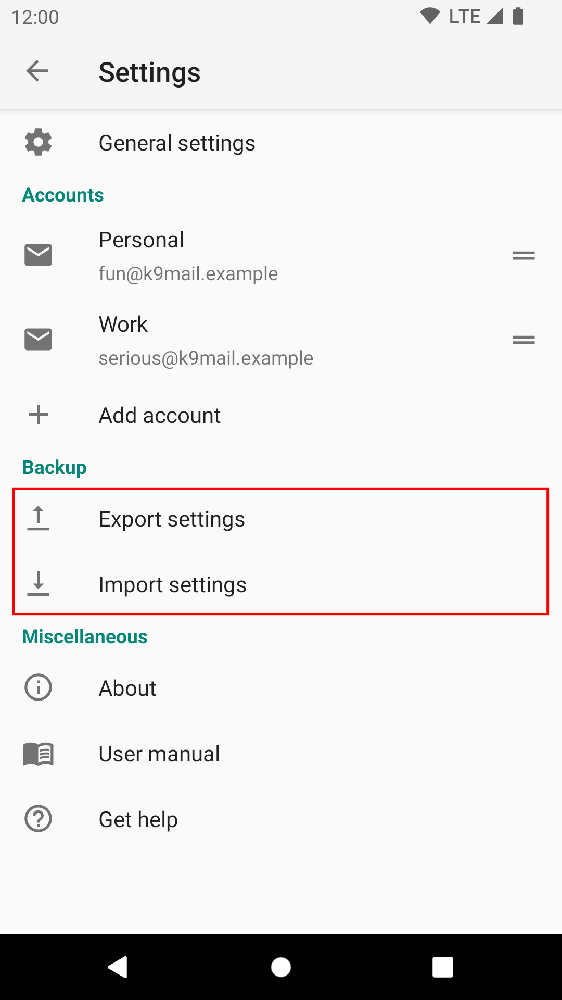
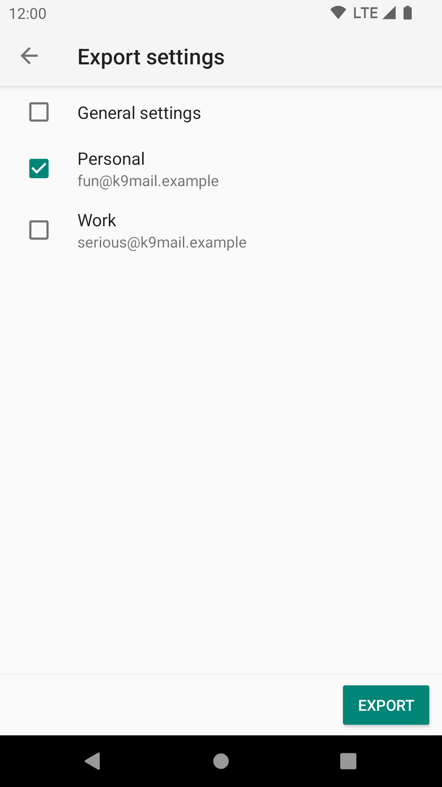

# Export Settings 

K-9 provides the ability to import and export your settings. This is useful when changing/adding a device.

The settings are exported as a file, stored in a location of your choice.

You can now move this file to a new device or just keep it there when you uninstall and then re-install K-9 Mail on the
same device. The settings file does not contain any of your passwords.

To export your settings, go to Settings -> Backup -> Export settings

By default you will export all your settings, including all account-specific settings. If you want to
export only the settings for a particular account, deselect the other accounts.

The "Export" button will prompt you for a location in which to save the settings file. 

Once saved to the file system, you can use the "Share" button to, for example, copy the settings file
to Google Drive, or email it as an attachment.