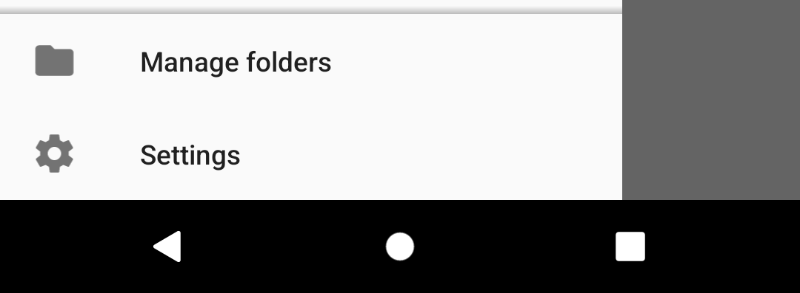

# Folder Settings

With the following settings you can configure how a specific folder is displayed. Furthermore you can classify the 
folder to control if and how it should be synchronized.

Folder settings for the selected account can be reached via "Manage folders", at the bottom of the drawer.

### Show in top group
Folders with this setting checked are displayed first in the folder list. Then the other folders follow in alphabetic 
order.

### Folder display class
Set the display class of a folder.

Available options:

* None
* 1st Class
* 2nd Class

To learn more about how this setting is used, read the page [Folder classes](folder_classes.md).

### Folder poll class
Set the poll class of a folder.

Available options:

* None
* 1st Class
* 2nd Class
* Same as display class

To learn more about how this setting is used, read the page [Folder classes](folder_classes.md).

### Folder push class
Set the push class of a folder. This setting is only available for IMAP accounts.

Available options:

* None
* 1st Class
* 2nd Class
* Same as push class

To learn more about how this setting is used, read the page [Folder classes](folder_classes.md).

### Folder notification class

Similarly to display, poll and push classes, you can set a notification class to control the notifications
for multiple folders at once.

Available options:

* None
* 1st Class
* 2nd Class
* Same as push class

### Unify
Enable this to make messages in this folder show up in the *Unified Inbox*.
