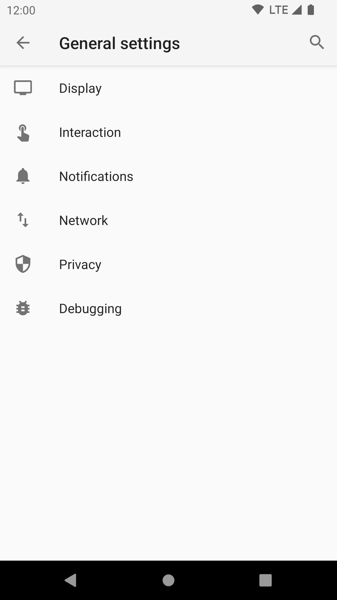

# General Settings 

*General settings* are account-independent settings. Most of them define how the user interface looks.

## Display
The Display settings control the global appearance of the app, as well as each of the 
main views, such as the account list, message lists and message display.

### Global 

#### Language
By default K-9 Mail displays the user interface in the language you're using for your Android system. With this 
setting you can override the system language, e.g. if your Android version doesn't support your native language but 
K-9 Mail does.

#### Theme
Available themes:

* Light
* Dark
* Use system default

#### Fixed message theme
When using the dark theme messages can look wrong. This is why K-9 Mail allows you to override the app theme.

Enabling this setting means K-9 always uses the theme configured in *Message view theme* below for the message view.
Not using a fixed message theme means you can select a theme in the menu of the message view.

#### Message view theme
This setting specifies the theme that is used for the message view.

Available settings:

* Light
* Dark
* Use app theme (default)

#### Composer theme
This setting specifies the theme that is used when composing a message.

Available settings:

* Light
* Dark
* Use app theme (default)

#### Font size

K-9 allows you to configure the font-size for various sections of the app.

The "Message body" slider is a percentage, default 100%.

#### Animation

Currently this only affects the animation when switching from the message list to the message view and back.

### Account List

#### Show Unified Inbox

This shows the Unified Inbox as the first item in the main application drawer. (Enabled by default)

#### Show starred count

Each folder and account always shows the count of unread messages. This option shows also the count of starred messages.

### Message lists

#### Preview Lines

Configures how many lines of each message to show when previewing them in a list. More preview lines mean
fewer messages can be shown at any one time.

#### Show stars

If you do not "star" messages you can disable the icon here to save space.

#### Show correspondent names

Disable this to display email addresses instead of correspondent names.

#### Correspondent above subject

Show correspondent names above the subject line, rather than below it.

#### Show contact names

If contacts are found in Android's Contacts, enabling this means that K-9 shows the name from there instead
of from the email itself.

#### Colorize contacts

Here you can select the color to use for correspondent names from your Contacts. All other correspondents will be
displayed in the default color. 

Only available when "Show contact names", above, is selected.

#### Contact name color

Choice of colour for the above option "Colorize contacts".

#### Show contact pictures

Disable this if you don't want to display contact pictures (or place holder images) in the message list.

#### Colorize missing contact pictures

If this is checked the place holder images for correspondents with missing contact pictures or ones not in your
Contacts will be displayed in different colors.
If this is disabled the images will be displayed with a grey background.

#### Change colour when read

Self-explanatory.

#### Threaded view
Threaded view is enabled by default and groups messages that belong to the same thread. Currently only messages in the
same folder are grouped. Specifically, this will not include messages sent by you if those messages are not also stored
in the current folder.

Please note that this is not the same as the conversation view you might know from e.g. Gmail.

To add own messages in threaded view: change *Sent folder* to *INBOX* in *Folder* settings under *Account settings*. 
Note: your own messages will no longer be stored (and synced) in the *Sent* folder.

#### Show split-screen
This setting allows you to display the message list next to the message view. This is mainly useful for devices with a
large screen, i.e. tablets.

Available settings:

* Always
* Never
* When in Landscape orientation

### Messages

#### Fixed-width fonts
When this is checked a fixed-width font will be used for plain text messages. The display of HTML messages is not 
influenced by this setting.

#### Visible message actions
Configure which message actions will be promoted to the first level of the menu in the message view.

**Note:** Checking an item doesn't mean that this action will be displayed in the action bar. There is only a limited 
number of actions that will be displayed in the action bar, the rest will move to the so called overflow menu that is 
accessible using the icon with the three dots.

#### Auto-fit message
Enable this to shrink messages to fit the screen width.

## Interaction

### Volume key navigation
Here you can specify whether you want to use the hardware volume keys to move up and down in the message list, or move 
to the previous and next message in the message view.

### Return to list after delete
When this setting is enabled deleting a message in the message view will return to the message list rather than moving 
to the previous/next message.

### Show next message after delete
Enabling this setting always moves to the next message after deleting a message from the message view. When it is 
disabled you move to the next or previous message depending on your previous travel direction.

### Confirm actions
Here you can specify which actions should display a confirmation dialog.

You can enable confirmations for the following actions:

* Delete (in message view)
* Delete Starred (in message view)
* Delete (from notification)
* Spam
* Discard message
* Mark all messages as ready

## Notifications

Only some options relating to notifications are shown here.
Most of the settings for notifications are under [Account Settings](account.md#notifications), which means you can 
choose different notification styles for each account.
 
### Quiet Time
You can set a *Quiet Time* to prevent notification from disturbing your sleep.

### Disable notifications

Completely disables notifications during Quiet Time.

### Quiet Time starts
Here you can specify the time when notifications will be disabled.

### Quiet Time ends
This time specifies the end of the *Quiet Time*, when notifications will be enabled again.

### Show 'Delete' button
K-9 Mail supports deleting messages directly from a notification.

The available settings are:

* Never
* For single message notifications
* Always (default)

### Lock Screen Notifications

Here you can configure how notifications for new messages are displayed when the device is locked.

The available options are:

* No lock screen notifications
* Application name
* New message count (default)
* Message count and senders
* Same as when screen unlocked

## Network

### Background sync
This setting specifies when K-9 Mail is allowed to synchronize messages in the background.

Available settings are:

* When 'Auto-sync' is checked (see below)
* Always
* Never (This disables mail checking for all accounts regardless of the account settings)

'Auto-sync' is an Android-wide setting that controls accounts that link to the device. Currently K-9 email accounts do 
not function in this way. However setting this will make the app reflect the general auto-sync setting.

The configuration of Android's Auto-sync setting may vary depending on your device's Android version and device 
manufacturer. On stock Android it's found under: "Settings -> Users & accounts -> Automatically sync data"

* [Google provide information about auto-sync and Nexus phones](https://support.google.com/nexus/answer/2840875?hl=en-GB)
* [Samsung provide instructions for their S6 phones.](https://www.samsung.com/hk_en/support/skp/faq/1075415)
* [On a technical level this is the result from `ContentResolver.getMasterSyncAutomatically()`](https://developer.android.com/reference/android/content/ContentResolver.html#getMasterSyncAutomatically())

## Privacy

### Hide mail client

Select this option if you don't want your recipients to know you're using K-9. Note, there may be
other ways for them to work it out.

### Hide timezone

Select this option if you don't want your recipients to know your timezone.

## Debugging

### Enable debug logging
Here you enable the logging of extra diagnostic information – e.g. if you're working with a developer to troubleshoot 
a problem. See the page on [logging errors](../misc/debugging.md) for more information.

Remember to disable debug logging once it's no longer required.

### Log sensitive information
By default, sensitive information like passwords are not saved in the logs, but this option enables logging of 
sensitive information.
