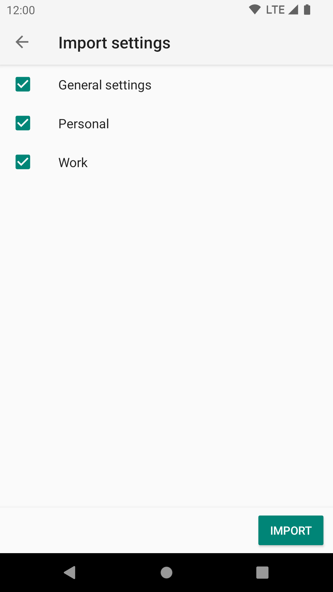
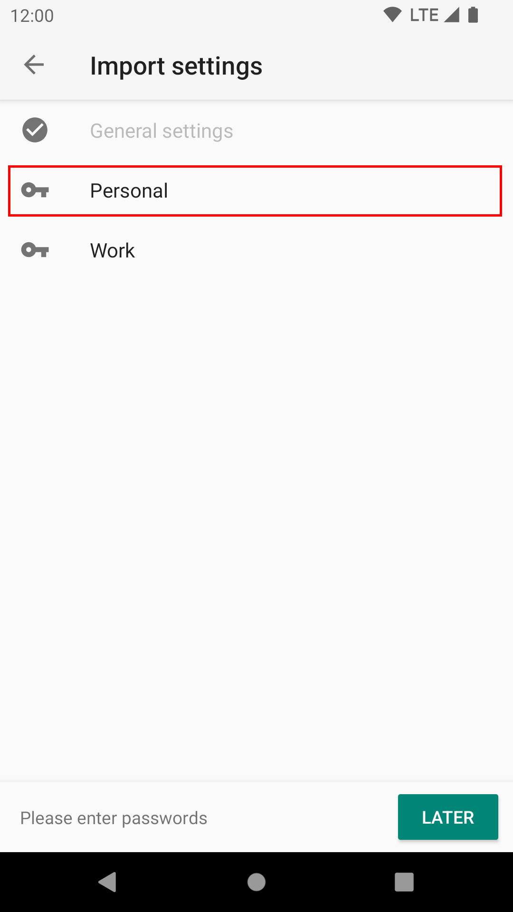

# Import Settings 

To import your previous settings file, go to Settings -> Backup -> Import settings

The settings are split into sections, allowing you to import the section you want.

When the import is complete you will be asked to provide the passwords to all the accounts you just imported. You can 
defer the account activation by pressing "Cancel", but you won't be able to use the account until you provide a 
password.

