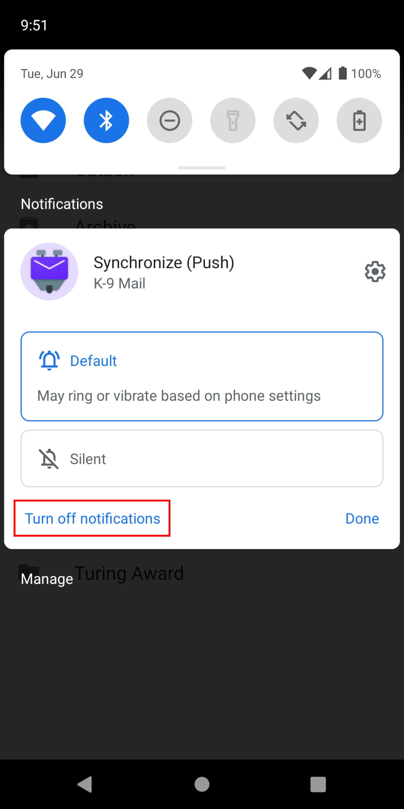
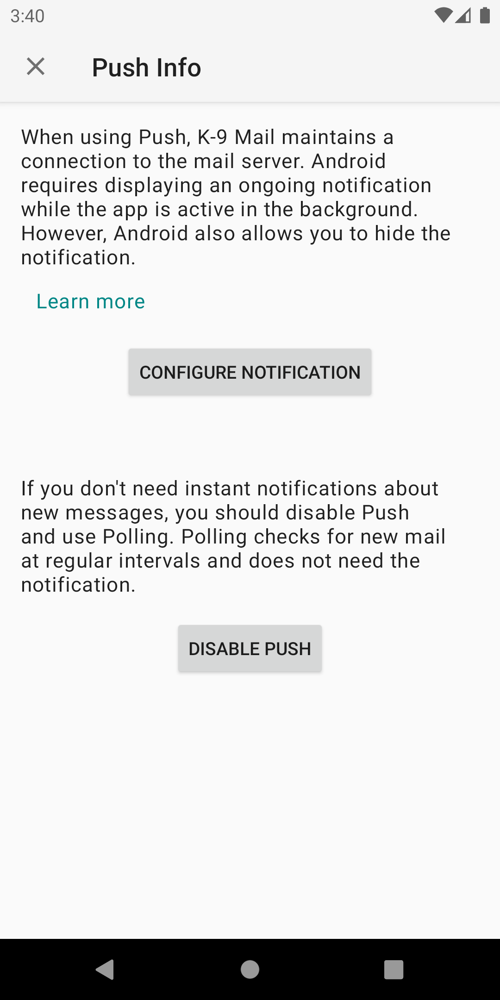

# IMAP Push

## Sync Types & K-9 Behavior

There are two ways of being notified of new mail synchronized to your device, Push and Poll.

- "Push" means that the server notifies K-9 of new email. This is immediate, therefore
the best choice if you want to be notified as soon as you have new mail. Unfortunately due to
Android battery optimizations and unreliable networks, it does not always work. Push is only available
with IMAP, not POP3.
- "Poll" means K-9 periodically checks the server to see if new mail exists.

Your choice of Push or Poll applies to each Folder Class within an account, rather than at the account level.

You can also manually synchronize an account. In this case, K-9 polls all subscribed folders.

Various actions within K-9 may cause it to perform an additional poll to ensure that the state is
consistent before/after they perform the action.

## Enable Push for an account

When setting up a new account Push is disabled by default. To enable it go to *Settings*, 
select the account you want to configure, then open the *Fetching mail* section. 
The *Push folders* setting is used to configure which class of folders should use the Push mechanism to wait for new messages.

 

If you're not familiar with K-9 Mail's folder class system, just select *Only 1st Class folders*.

## Enable Push for a folder

To configure which folders belong to the "1st Class folders" group, open the side drawer and select *Manage folders*.

Select the folder you want to configure. Then in the folder settings screen pick *1st Class* from the list of options for the *Folder push class* setting.

 

Repeat this process for every folder you want to check via Push. But try to keep the number of folders as low as possible. The app has to maintain an open connection for every Push folder. Most servers put a rather low limit on how many open connections per user are allowed. More connections also mean more network traffic and more system resources used on your Android device.

## @ Notification

K-9 Mail uses a so-called foreground service to signal to Android that the app is doing important work and should be exempt from power saving measures Android usually applies to apps running in the background. Foreground services need to display an ongoing notification so users are aware that the app is running and potentially doing resource-intensive things.

K-9 Mail's notification is showing an *@* symbol in the status bar. If you expand the notification drawer you'll usually see the text "Waiting for new emails" being displayed.

Most users will want to run K-9 Mail in the background all the time. So this notification doesn't provide much value. There are two options to remove the icon from the status bar.

### Option 1: Turn off the notification

Android requires apps to create the notification. But it allows users to turn off the notification. To do so, long-press the notification in the expanded notification drawer and select *Turn off notifications*, then toggle the *Synchronize (Push)* option.

 

### Option 2: Minimize the notification

The notification does show some status information, e.g. when waiting for network connectivity. If you want to keep the notification but get rid of the icon in the status bar you can "minimize" the notification.
Long-press the notification in the expanded notification drawer and select the gear icon in the upper right corner. Then tap the *Synchronize (Push)* text (not the switch next to it).

In the screen to configure the *Synchronize (Push)* notification select the *Silent* option and turn on the *Minimize* switch.

This will remove the @ icon from the status bar and displays a collapsed version of the notification at the bottom of the expanded notification drawer.

---

## Disable Push

To disable Push, tap the notification, then press the *Disable Push* button.

This will change the *Push folders* setting to *None* for all accounts.
This will change the *Push folders* setting to *None* for all accounts.

## What to do when Push is not working reliably?

Some vendors have modified the Android versions on their devices to use very aggressive power saving measures. Check out the website [Don't kill my app!](https://dontkillmyapp.com/) to learn how to best configure your device.