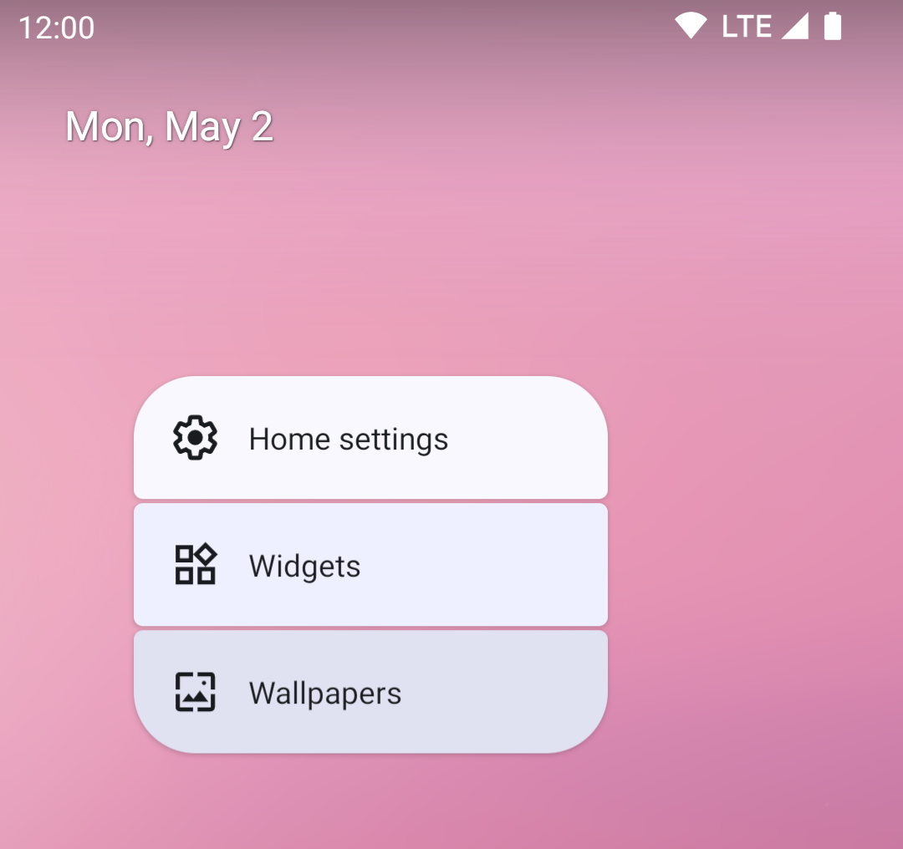
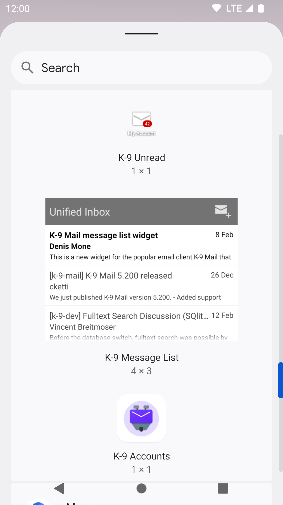

# Widgets

As well as application icons, Android allows users to add widgets to their launcher screens.

K-9 has a small number of built-in widgets to show information in the launcher.

You add a widget by long-pressing in an empty section of the launcher screen:

Tap "Widgets" and then scroll down to find the K-9 widgets.

## K-9 Unread

The unread email widget is connected to the unread messages for a single inbox, all messages or unified inbox.
You choose the particular account for the unread count once you drop the widget in place. If you want
to change the account, just delete and recreate the widget.

The icon for this is an envelope.

## K-9 Message List

The message list widget shows you a list of messages from the Unified Inbox view.
The envelope icon in the corner allows you to compose a new message.

## K-9 Accounts

The accounts widget allows you to have an icon that links directly to the inbox of an account.

The icon for this is the K-9 mascot, the same as the application icon. The icon's label is the same as
the linked account's name.
