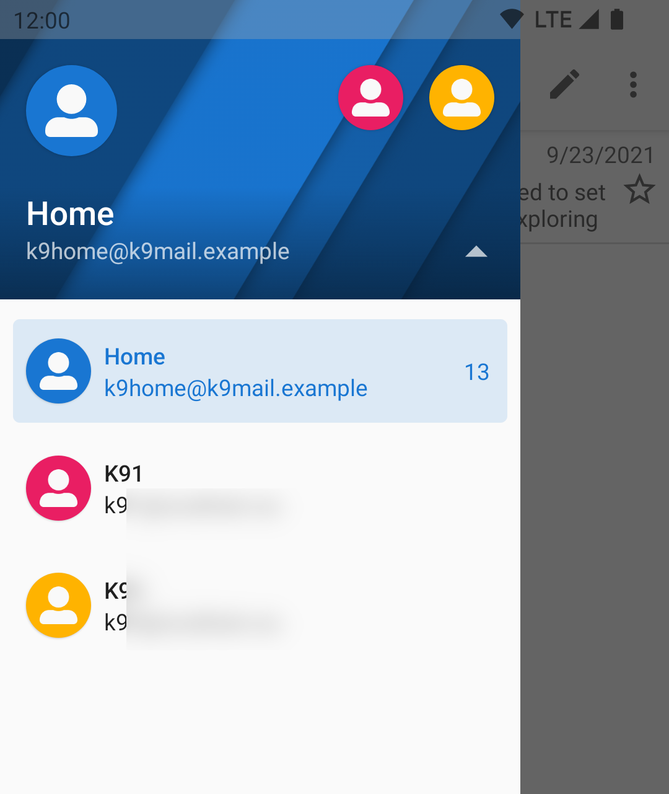

# Unified Inbox

## Display

By default, K-9 Mail combines the messages from your accounts into a single view called the Unified Inbox.
The coloured chip to the left of the subject line shows you which account owns that message.

The colours match the account colours that you can see when you open the sidebar.

You can change these colours, see [Account Color](../settings/account.md#account-color).

## Adding and removing folders

You can include any folder you like in the Unified Inbox. By default, the Inbox folder of each account is
included.

To add or a remove a folder, make sure you have the correct account selected in the sidebar. Then select
Manage Folders -> (folder name e.g. Inbox) -> Unify.

## Disabling

To disable the unified inbox, go to Settings -> General Settings -> Display -> Account List -> Show Unified Inbox. 
See also the documentation page [Settings](../settings/general.md#show-unified-Inbox).