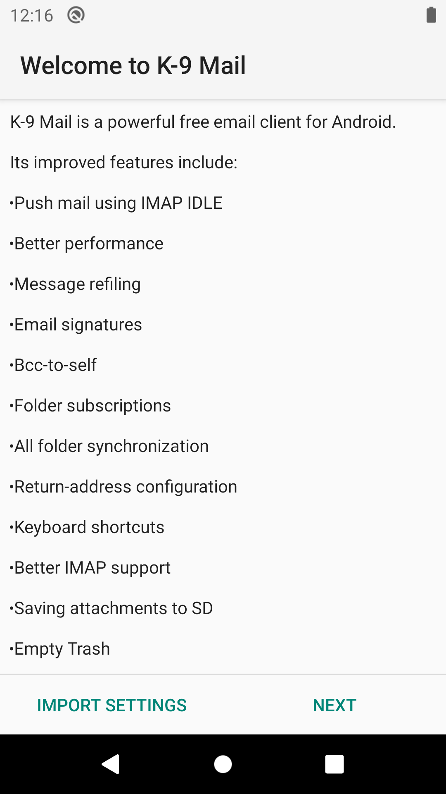

# Initial Set-Up / Welcome Screen

When you first launch K-9 you will be shown a welcome screen giving you a 
run down of the features. Clicking 'Next' allows you to [add an account](../accounts/add.md). Alternatively if you have 
previously saved settings you can [import them](../settings/import_export.md).

{: class="screenshot"}
